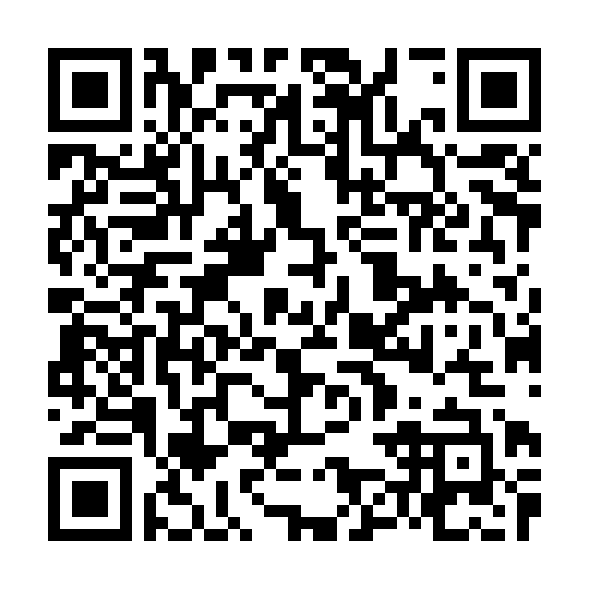

# 画像解析・画像AI特論 講義概要

## 講義について

画像解析・画像AI特論の講義資料です。

## 目次

*   [第1章: ディジタル画像の基礎理論](lecture01.md)
*   [第2章: 画像フィルタリングと画質改善技術](lecture02.md)
*   [第3章: MRIの基礎原理](lecture03.md)

<figure>
  
  <figcaption>Home</figcaption>
</figure>

## 自己紹介
- 名前：　内田　航　（Wataru Uchida, PhD）
- 所属・役職：　順天堂大学 健康データサイエンス学部 助教
- 連絡先： w-uchida@juntendo.ac.jp
- 経歴：
    - 2018年 診療放射線技師 国家資格 取得
    - 2021年 東京都立大学大学院 博士前期過程 修了 （放射線学）
    - 2024年 順天堂大学大学院 医学研究科 放射線診断学講座 博士課程 修了（医学）
- 研究：
    - MRI（Magnetic Resonanse Imaging）の画像解析
    - 特に、脳の拡散MRI信号値のモデリングによる神経微細構造推定が専門です。微細構造推定により、専門家の読影（診断）では目に見えないレベルの軽微な（発症早期の）構造・機能変化を捉えることで疾患の早期診断や予後予測モデルの開発に従事しています。
- [ResearchGate](https://www.researchgate.net/profile/Wataru-Uchida/research)
- [健康データサイエンス研究科 研究室紹介](https://www.juntendo.ac.jp/academics/graduate/hds/research/laboratory/)

